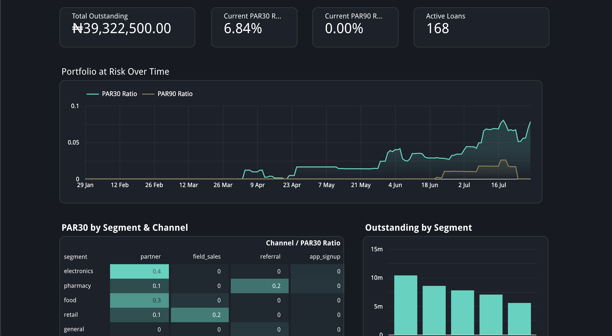
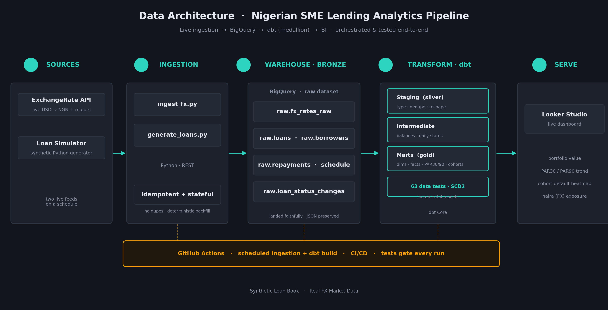
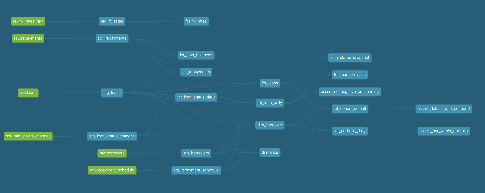

# Nigerian SME Lending: Analytics Engineering Pipeline

A data pipeline for Nigerian SME lending. It pulls live data on a schedule, models it in a dbt medallion warehouse, reports portfolio risk (PAR30/PAR90), and runs its full test suite on every build through CI/CD.

[](https://github.com/ExcelWhite/excel-fintech-pipeline/actions/workflows/ingest.yml)
&nbsp;·&nbsp; **[Live Dashboard](REPLACE_WITH_YOUR_LOOKER_LINK)** &nbsp;·&nbsp; Built with BigQuery, dbt, Python, GitHub Actions, and Looker Studio

---

[](REPLACE_WITH_YOUR_LOOKER_LINK)

<p align="center"><em>Live portfolio-risk dashboard. Click to open the interactive version.</em></p>

---

## What this is

A lot of Nigerian SME lenders still run on spreadsheets and instinct. Their loan, repayment, and borrower records sit in separate places, so a question like "what's our PAR30 by acquisition channel?" or "which cohort is defaulting?" can take days to answer, if it gets answered at all.

This project is the data platform that answers those questions on its own. It ingests financial data, turns it into clean and tested tables, and serves risk metrics to a live dashboard. It is the kind of system a lending company's data team actually runs.

It pulls from two feeds:

- **Live FX market data.** USD to NGN and the major currencies, from a public exchange-rate API. This gives the pipeline real external data that times out, drifts, and generally behaves the way production data does.
- **A synthetic loan book.** A Python generator that simulates borrowers, disbursements, repayments, and delinquency for a lending fintech. Real lending data isn't public, so the book is generated. The generator keeps state and runs off a fixed seed, so the history stays coherent and reproduces exactly.

The loan book is synthetic on purpose. The FX data is genuinely live, and the engineering around both (ingestion, modeling, testing, orchestration) is the real thing, built the way it would be for production.

## Architecture



Data moves left to right: two live sources feed Python ingestion, which lands raw data in BigQuery (bronze), which dbt transforms through the medallion layers, which Looker Studio reads. GitHub Actions sits under all of it, running the schedule, the CI/CD, and the tests on every build.

## The stack

| Layer | Tool | What it does |
|---|---|---|
| Ingestion | **Python** (`requests`, `google-cloud-bigquery`) | Idempotent, stateful loaders for FX and loan data |
| Warehouse | **BigQuery** | Cloud data warehouse (bronze to gold) |
| Transformation | **dbt Core** | Medallion modeling: staging, intermediate, marts |
| Orchestration & CI/CD | **GitHub Actions** | Scheduled ingestion plus `dbt build`; tests gate every run |
| BI | **Looker Studio** | Live portfolio-risk dashboard |

## How it's built

The parts worth pointing at:

**Ingestion is idempotent and stateful.** The loaders check what's already in the warehouse before they write, so re-running never duplicates anything. The loan generator reads prior state and appends only new events, the way an incremental pipeline behaves. A fixed seed means the entire history can be rebuilt identically.

**The warehouse follows the medallion pattern.** Raw data lands untouched in bronze. Staging models clean and reshape it. Intermediate models carry the heavier business logic. Marts serve the finished facts and dimensions. Dependencies only ever run one direction.

**PAR is answerable as of any past date.** The `fct_loan_daily` model expands each loan into one row per day, carrying the status it held on that day. That's what lets PAR30 and PAR90 be computed for any historical date, not just today. Portfolio metrics and cohort default rates build on top of it.

**Tests gate the build.** There are 63 dbt tests covering uniqueness, not-null, referential integrity, and accepted values, plus custom checks like "outstanding balance can never be negative" and "PAR balance can never exceed the portfolio." They run on every scheduled build, and a failure fails the run.

**Incremental models and SCD Type 2 snapshots are in the repo.** See `models/marts/fct_loan_daily_inc.sql` and `snapshots/loan_status_snapshot.sql`. Both rely on `MERGE`, which needs a billing-enabled BigQuery warehouse. This project runs on the free tier, so they carry a `requires_billing` tag and stay out of the scheduled build. The code is finished; turning on billing and removing the exclude flag is all it takes to run them.

## Data model

The dbt lineage graph, from sources through staging and intermediate to marts, with tests and snapshots downstream:



The gold marts:

- `fct_loan_daily`: one row per loan per day, the model PAR is built on
- `fct_portfolio_daily`: daily PAR30/PAR90 and outstanding balance by segment and channel
- `fct_cohort_default`: default rate by disbursement cohort and acquisition channel
- `fct_fx_rates`: daily USD to NGN and major-currency rates
- `dim_borrower`, `dim_date`: conformed dimensions

## Running it locally

You'll need Python 3.12, a Google Cloud project with BigQuery, and a service-account key.

```bash
# 1. Install dependencies
python -m venv .venv && source .venv/bin/activate
pip install -r requirements.txt

# 2. Add your BigQuery service-account key as sa-key.json in the repo root
#    (git-ignored, never committed)

# 3. Ingest data
python scripts/ingest_fx.py        # live FX rates -> BigQuery
python scripts/generate_loans.py   # synthetic loan book -> BigQuery

# 4. Build and test the warehouse
cd fx_dbt
dbt build --exclude tag:requires_billing --profiles-dir .
```

It also runs on its own through GitHub Actions on a schedule. See [`.github/workflows/ingest.yml`](.github/workflows/ingest.yml).

## Repository layout

```
├── scripts/            # Python ingestion & loan generation
├── fx_dbt/             # dbt project
│   ├── models/
│   │   ├── sources/    # bronze source declarations
│   │   ├── staging/    # silver: clean & reshape
│   │   ├── intermediate/  # business logic
│   │   └── marts/      # gold: facts & dimensions
│   ├── snapshots/      # SCD2 loan-status history
│   └── tests/          # custom singular tests
├── .github/workflows/  # scheduled ingestion + dbt build (CI/CD)
└── docs/images/        # dashboard, architecture, lineage
```

---

<p align="center">
Built by <strong>Elisha Enefu</strong>, Analytics Engineer<br>
<a href="REPLACE_WITH_YOUR_LOOKER_LINK">Live Dashboard</a> · <a href="https://github.com/ExcelWhite">GitHub</a>
</p>